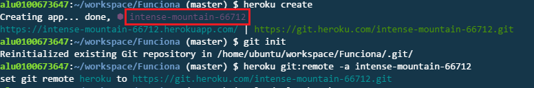

# Práctica 4: Nueva funcionalidad para el paquete npm
## Paquete: gitbook-start-heroku-merquililycony


# Objetivo:
*El objetivo de esta práctica es extender el package NodeJS publicado en npm en una práctica anterior con una nueva*
*funcionalidad que permita que los usuarios realizar un despliegue automatico en el servidor de IAAS*
# Práctica 5 : Nueva funcionalidad para el Paquete NPM: plugins 

# Objetivo:
*El objetivo de esta práctica es extender el package NodeJS publicado en npm en una práctica anterior con una nueva*
*funcionalidad que permita que los usuarios con conocimientos de NodeJS puedan extender la conducta del ejecutable*
*para que este realice el despliegue en plataformas distintas de las ya consideradas.*


[Plugin: gitbook-start-heroku-merquililycony](https://github.com/ULL-ESIT-SYTW-1617/gitbook-start-heroku-merquililycony)

1- Descargamos el paquete inicial: **nueva-funcionalidad-para-el-paquete-npm-merquililycony**
    
```bash
$ npm install -g nueva-funcionalidad-para-el-paquete-npm-merquililycony
```

2- Creamos el libro :
    
```bash
$ gitbook-start -d <directorio> 
```

3- Nos colocamos en la carpeta que contiene el libro.

```bash
$ cd <directorio>
```

4- Instalamos las dependencias necesarias:
    
```bash
$ npm install 
```

5- Instalamos los plugins necesarios como dependendecias utilizando para ello la opción --save heroku:
    
```bash
$ npm install --save gitbook-start-heroku-merquililycony
```
6-Hacemos gulp-deploy para generar el libro 

```bash
$ gulp deploy
```
7- Hacemos gulp crear-repo para crear el repo en github

```bash
$ gulp crear-repo
```
8- Hacemos gulp push para subir los cambios

```bash
$ gulp push
```
9- Loguearse en Heroku

```bash
$ heroku login
```
10- Crear app y copiar el nombre de la app

```bash
$ heroku create
```
 
11- Añadimos el remoto

```bash
$ heroku git:remote -a <nombre_app>
```
12- Desplegar app en heroku con gulp deploy-heroku

```bash
$ gulp deploy-heroku
```
## Enlaces :

 **Enlace al campus virtual**

 * [Enunciado](https://casianorodriguezleon.gitbooks.io/ull-esit-1617/content/practicas/practicaplugin2.html)

 **Repositorio GitHuB donde se realizó la práctica**
 * [Repo nueva funcionalidad](https://github.com/ULL-ESIT-SYTW-1617/nueva-funcionalidad-para-el-paquete-npm-plugins-merquililycony/)
 * [Repo paquete](https://github.com/ULL-ESIT-SYTW-1617/gitbook-start-heroku-merquililycony)

 **Enlace a Gh-pages**

 * [gh-pages](https://ull-esit-sytw-1617.github.io/nueva-funcionalidad-para-el-paquete-npm-plugins-merquililycony/)

 * [npm](https://www.npmjs.com/package/gitbook-start-heroku-merquililycony)

 **Página de los autores**

 * [Constanza](http://alu0100673647.github.io)
 * [Merquis](http://merquis.github.io)
 * [Liliana](https://alu0100762846.github.io)


